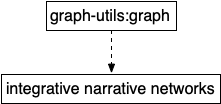
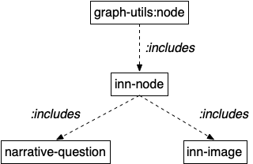

# Integrative Narrative Networks
<b>Remi van Trijp</b>
<br>Sony Computer Science Laboratory - Paris
<br>[remi.vantrijp@sony.com](mailto:remi.vantrijp@sony.com)

<hr>

*Version 0.5, 4 April 2023*

The `:inn` package offers a framework for building networks and visualizing and interactively modifying them using [vis.js](https://visjs.org/) in Babel's web interface. While the package can be used for many kinds of networks, it is finetuned for supporting <b>integrative narrative networks</b>:

* <b>Integrative:</b> The networks may include nodes and edges that represent information coming from various knowledge sources (e.g. the human user, knowledge graphs and ontologies) and information processing tasks (e.g. semantic parsing, constructional language processing, sensorimotor perception). 
* <b>Narrative:</b> The networks are built on the notion of "narrative questions" that a human or AI system may ask during the sense-making process. The network comes to "narrative closure" if the main narrative question has been answered.
* <b>Networks:</b> The choice for representing the understanding process as a network of narrative questions (and answers) helps to visualize the interaction between many different components, and can be exploited for measuring the degree of understanding that a system has about a certain topic or task.

## Contents
1. [Conceptual Foundations](#conceptual-foundations)
2. [Definitions](#definitions)
<br>2.1. [Integrative Narrative Network (*class*)](#inn-class)
<br>2.2. [INN Nodes](#inn-nodes)
<br>       2.2.1. [inn-node (*defstruct*)](#inn-node)
<br>       2.2.2. [narrative-question (*defstruct*)](#narrative-question)
<br>       2.2.3. [inn-image (*defstruct*)](#inn-image)
<br>       2.2.4. [def-inn-node (*macro*)](#def-inn-node)
<br>2.3 [INN Edges](#inn-edges)
3. [Visual Identity](#visual-identity)
4. [Maintaining and Updating the Network](#network-management)
5. [Advanced Interface Options](#interface)
6. [Tutorial: How to use the INN package](#tutorial)
<br>
<br>
[Acknowledgements](#acknowledgements)<br>
[References](#references)<br>
[Appendix: Known Issues](#issues)

<a name="conceptual-foundations"></a>
## 1. Conceptual Foundations 

The code of the `:inn` package offers a set of tools for Babel researchers to easily construct, visualize and interactively manipulate networks in their work. Besides offering these tools, the `:inn` package has been explicitly designed to facilitate research on **meaning and understanding in human-centric artificial intelligence**. More specifically, it includes dedicated code based on the idea of **narrative understanding**.

[To be completed. In the meantime, please read the following paper that formed the inspiration for the `:inn` package.]

* Steels, Luc and Lara Verheyen and Remi van Trijp (2022). [An Experiment in Measuring Understanding](https://ceur-ws.org/Vol-3322/short6.pdf). In: Lise Stork, Katrien Beuls and Luc Steels (eds.), Proceedings of the Workshop on Semantic Techniques for Narrative-Based Understanding
co-located with 31st International Joint Conference on Artificial Intelligence and the 25th European Conference on Artificial Intelligence (IJCAI-ECAI 2022), pp. 36-42. Vienna: CEUR Workshop Proceedings.

<a name="definitions"></a>
## 2. Definitions

If it is your first time using the `:inn` package, please check the file `examples.lisp` for a hands-on introduction to integrative narrative networks, or check out [the tutorial section](#tutorial) of this document.

<a name="inn-class"></a>
### 2.1. Integrative Narrative Network (*class*) ###

#### <i>class</i>               **integrative-narrative-network**
<hr>
**Description:**         Base class for integrative narrative networks.<br>
**Parent class:**       `graph-utils:graph`
<p align="center">
	
</p>
**Example:**             `(make-instance 'integrative-narrative-networks)`<br>

<a name="inn-nodes"></a>
### 2.2. INN Nodes ###

The networks of the `:inn` package are built on top of the `:graph-utils` library, which defines nodes and edges as defstructs. This makes it more difficult to create custom kinds of nodes because the `:include` option of a defstruct only accepts one "parent" structure, which is the `:inn` package uses a helper macro for defining custom nodes.

<a name="inn-node"></a>
#### 2.2.1. INN-NODE (*defstruct*)

#### <i>defstruct</i>               **inn-node**
<hr>
**Description:**                  Basic "class" for nodes.<br>
**Includes:**                       `graph-utils:node`<br>
**Default Type:**                 `T`<br>
**Other possible types:**   `:entity`, `:predicate` or user-specified <br>
<br>
**Slots and values:**<br>
*id*                 An integer. Is handled automatically and should not be set manually.<br>
*type*             A keyword such as `:entity` or `:predicate`, or a symbol.<br>
*label*            A string. Use NIL or empty string "" for nodes without labels.<br>
*color*            Do not set manually. Use the method `get-node-color` instead.<br>
*shape*          Do not set manually. Use the method `get-node-shape` instead.<br>
*description*  A string. A description of the node.<br>
*attributes*     A list of (:keywords values). For storing information that has no impact on the visualization of a node.<br>
*cluster-ids*    A list of (keys values). Used for allowing custom clustering functions.<br>
*weight*         Inherited from `graph-utils`. Not used for the moment.<br>
*value*           Inherited from `graph-utils`. Not used for the moment.<br>
<br>
**Constructing an inn-node**<br>
It is highly recommended to use the constructor function `make-inn-node`, e.g.:

```
(make-inn-node :type :entity)
```
This constructor function will call on the methods `get-node-color` and `get-node-shape` to initialize the default value of the color and shape slots of the structure, unless you specified other values. The *actual* constructor function that constructs the `inn-node` structure is `#'%make-inn-node` but you should refrain from using it yourself.
<br>
<br>
**Accessor Functions**<br>

All slots can be accessed and set using the defstruct convention of Common Lisp inn-node-*slot-name*, e.g. `#'inn-node-id`.<br>
<br>
It is recommended to use the default `inn-node` structure as much as possible, and customize node visuals and behaviors using new keywords and the attributes slot. Nevertheless, two "subclasses" have been predefined: `narrative-question` and `inn-image`.
<br>
<br>
<p align="center">
	
</p>

<a name="narrative-question"></a>
#### 2.2.2. NARRATIVE-QUESTION (*defstruct*)

#### <i>defstruct</i>               **narrative-question**
<hr>
**Description:**                  "class" for narrative questions.<br>
**Includes:**                       `inn-node`<br>
**Default Type:**                 `:open-narrative-question`<br>
**Other possible types:**   `:answered-narrative-question` or user-specified <br>
<br>
**Additional slots and values:**
<br> In addition to the slots inherited from `inn-node`, a narrative-question has the following slots:<br>


*posed-by*         A symbol. The user, knowledge source or cognitive system which introduced the question.<br>
*answered-by*   A symbol. The user, knowledge source or cognitive system which provided the answer.<br>
*bindings*          A list of bindings. Unused for the time being.<br>
*irl-programs*    A list of IRL-programs in which the question occurs. Unused for the time being.<br>
<br>
**Constructing a narrative-question**<br>
It is highly recommended to use the constructor function `make-narrative-question`, e.g.:

```
(make-narrative-question :label "lives-in?")
```
By default, a narrative question has the type `:open-narrative-question`, which means it is still unanswered. Introducing answered questions, which take on a different visual identity, can be achieved either by specifying the type:

```
(make-narrative-question :type :answered-narrative-question)
```
<br>
Or by using a dedicated helper function:

```
(make-answered-narrative-question)
```
<br>
**Accessor Functions**<br>

All slots can be accessed and set using the defstruct convention of Common Lisp inn-node-*slot-name*, e.g. `#'narrative-question-posed-by`.<br>

<a name="inn-image"></a>
#### 2.2.3. INN-IMAGE (*defstruct*)

#### <i>defstruct</i>               **inn-image**
<hr>
**Description:**                  "class" for nodes visualized using images.<br>
**Includes:**                       `inn-node`<br>
**Default Type:**                 `:inn-image`<br>
**Other possible types:**   User-specified. <br>
<br>
<br>
**Additional slots and values:**
<br> In addition to the slots inherited from `inn-node`, an inn-image has the following additional slot:<br>

*url*         A string. The URL (or path accessible by the web interface) where the image is located.<br>
<br>
**Constructing a narrative-question**<br>
It is highly recommended to use the constructor function `make-inn-image`, e.g.:

```
(make-narrative-question :description "A painting by Lorenzo Lotto")
```
By default, this structure has the type `:inn-image`, which ensures that the node will be visualized using an image specified in the `url` slot, or a default placeholder image.
<br>
<br>
**Accessor Functions**<br>

All slots can be accessed and set using the defstruct convention of Common Lisp inn-image-*slot-name*, e.g. `#'inn-image-url`.<br>

<a name="def-inn-node"></a>
#### 2.2.4. DEF-INN-NODE (*macro*)

If it is nevertheless desirable to implement a new "class" of node, it is recommended to use the macro `def-inn-node` that will expand into a `defstruct` and a dedicated `make-x` constructor function.

#### <i>macro</i>               **def-inn-node**
<hr>
**Arguments:**<br>
*Name*              The name of your node class.<br>
*Parent*              A parent with optionally default value for slots. Only one parent allowed.<br>
*Body*                A description (string) followed by slots (and possible initial values) using the defstruct syntax.
<br>
<br>
**Example without defaults**

In the simplest case, the macro can be used for creating a node that inherits all of the slots of its parent node without specifying any other defaults. Note that it is highly recommended to include a description string in the body of the macro in which you specify which *types* (keywords) are compatible with your node, because this information will be used by the web interface for helping the users if they want to add nodes manually.

```
(def-inn-node my-inn-node (inn-node)
   "Type (:my-inn-node-type)"
   slot-1)
```
<br>
**Example with defaults**

It is recommended to at least specify a default type. Specifying defaults uses the same syntax as the `defstruct` macro.

```
(def-inn-node my-inn-node (inn-node
                             (type :my-inn-node-type))
   "Type (:my-inn-node-type)"
   (slot-1 "Default string."))
```

**Constructor Functions**

The macro `def-inn-node` will automatically create constructor functions following the defstruct convention make-*struct-name*, e.g. `make-my-inn-node`. These constructor functions ensure compatability with the inn framework by calling the general `make-inn-node` constructor function. The *real* constructor functions are named %make-*struct-name*, e.g. `%make-my-inn-node`, but you should refrain from using them.
<br>
<br>
**Accessor Functions**<br>

All slots can be accessed and set using the defstruct convention of Common Lisp *you-node-name*-*slot-name*, e.g. `#'my-inn-node-slot-1`.<br>

<a name="inn-edges"></a>
### 3.3. INN-Edges

<a name="visual-identity"></a>
## 4. Visual Identity

<a name="visual-nodes"></a>
### 5.1. Nodes

The visual identity of nodes is governed by three generic functions:
* `get-node-color`
* `get-node-shape`
* `inn-format-node`

#### <i>generic function</i>               **get-node-color**
<hr>
**Arguments:**<br>
*type*              A keyword that your defmethod specialized on.

**Return value:**<br>
A string that represents the color of the node following HTML standards, such as "red" or "#6666ff". Please see the [vis.js documentation](https://visjs.github.io/vis-network/docs/network/) for more details.

**Description**<br>
This generic function is used for customizing the node color depending on which *type* (a keyword) is specified. There is one defmethod that accepts you to pass the node itself instead of its type, but this method will simply take the node's type and call the method that specializes on that type. It is therefore important to implement your own defmethod if you want a node to appear in a particular color. 

**Example**

```
(defmethod get-node-color ((type :eql :open-narrative-question))
  (declare (ignore type))
  "red")
```

#### <i>generic function</i>               **get-node-shape**
<hr>
**Arguments:**<br>
*type*              A keyword that your defmethod specialized on.

**Return value:**<br>
A string that represents the shape of the node, such as "rectangle" or "circle" (for basic shapes) or "image" and "circularImage" (for images). Please see the [vis.js documentation](https://visjs.github.io/vis-network/docs/network/) for more details.

**Description**<br>
This generic function is used for customizing the node shape depending on which *type* (a keyword) is specified. There is one defmethod that accepts you to pass the node itself instead of its type, but this method will simply take the node's type and call the method that specializes on that type. It is therefore important to implement your own defmethod if you want a node to appear in a particular color. 

**Example**

```
(defmethod get-node-shape ((type :eql :open-narrative-question))
  (declare (ignore type))
  "diamond")
```

#### <i>generic function</i>               **format-inn-node**
<hr>
**Arguments:**<br>
*inn-node*              An inn-node (or substructs).

**Return value:**<br>
A string that represents the node in the syntax of vis.js. Please see the [vis.js documentation](https://visjs.github.io/vis-network/docs/network/) for more details.

**Description**<br>
This generic function is used for representing a node in vis.js (and how it is displayed in the web interface).

**Example 1**

```
(defmethod inn-format-node ((id integer))
  (format nil "{ id: '~a'}" id))
```

**Example 2**

```
(defmethod inn-format-node ((node inn-node))
    (format nil "{ id: '~a', label: '~a', color: '~a', shape: '~a'~a}"
            (inn-node-id node)
            (or (inn-node-label node) "")
            (inn-node-color node)
            (inn-node-shape node)
            (format-cluster-ids (inn-node-cluster-ids node))))
```

<a name="network-management"></a>
## 6. Maintaining and Updating the Network

<a name="interface"></a>
## 7. Advanced Interface Options

<a name="tutorial"></a>
## 8. Tutorial: How to Use the INN Package


<a name="acknowledgements"></a>
### Acknowledgements

The work described in this technical report greatly benefited from discussions with and feedback from Luc Steels, Lara Verheyen, Sofia Baroncini, and other contributors to the Babel software suite. Its development is funded by the [Sony Computer Science Laboratory - Paris](https://csl.sony.fr/) and the [MUHAI](https://muhai.org/) (Meaning and Understanding in Human-Centric AI), a project funded from the European Union's Horizon 2020 research and innovation programme under grant agreement No 951846. 


<a name="references"></a>
### References

* Steels, Luc and Lara Verheyen and Remi van Trijp (2022). [An Experiment in Measuring Understanding](https://ceur-ws.org/Vol-3322/short6.pdf). In: Lise Stork, Katrien Beuls and Luc Steels (eds.), Proceedings of the Workshop on Semantic Techniques for Narrative-Based Understanding
co-located with 31st International Joint Conference on Artificial Intelligence and the 25th European Conference on Artificial Intelligence (IJCAI-ECAI 2022), pp. 36-42. Vienna: CEUR Workshop Proceedings.


<a name="issues"></a>
### Appendix: Known Issues
* Open narrative questions not always change color automatically when necessary
* Storing and restoring networks is currently incompatible with OpenCCL.